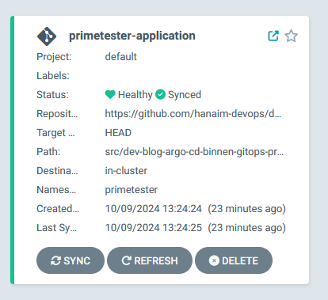
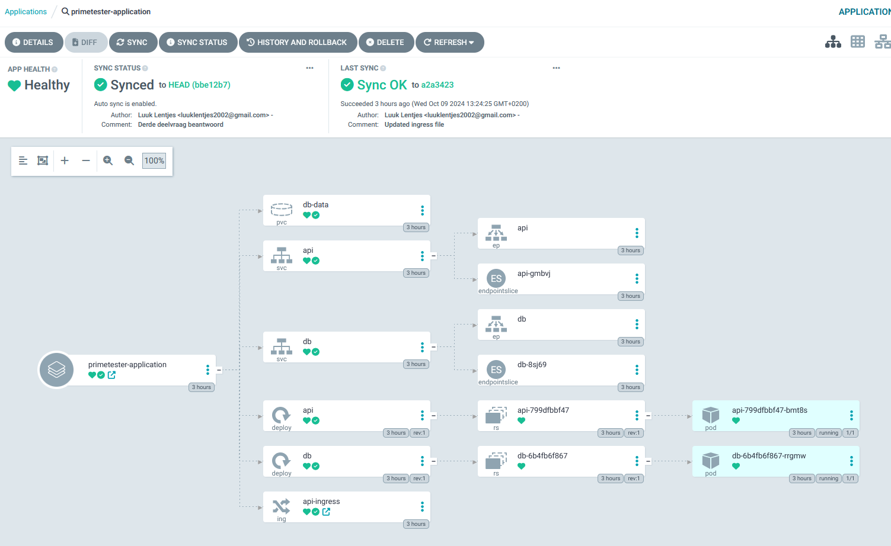

# Argo CD binnen GitOps-processen en Kubernetes

*[Luuk Lentjes, oktober 2024.](https://github.com/hanaim-devops/devops-blog-luuk-lentjes/tree/main/src/dev-blog-argo-cd-binnen-gitops-processen-en-kubernetes)*
<hr/>

In mijn onderzoek kijk ik naar hoe je Argo CD kunt inzetten binnen GitOps-processen en Kubernetes. Tijdens mijn 
huidige minor DevOps hebben we de principes van GitOps en continuous delivery behandeld, waarbij de focus ligt op 
het automatiseren en optimaliseren van het deploymentproces. Argo CD speelt een belangrijke rol door zijn 
declaratieve aanpak, waarmee je de staat van applicaties en infrastructuur via een Git-repository beheert. In dit 
onderzoek laat ik zien hoe je Argo CD praktisch toepast binnen deze processen en welke voordelen en uitdagingen je 
tegenkomt.

## Introductie Argo CD
Argo CD is een declaratieve GitOps-tool die continue delivery binnen Kubernetes ondersteunt. Dat betekent dat je 
de gewenste eindtoestand beschrijft van je applicatie en infrastructuur, zonder dat je stap-voor-stap- handelingen uitvoert om
die te bereiken. Argo CD automatiseert, controleert en vereenvoudigt applicatiedeployments en lifecycle management, 
waardoor het eenvoudig blijft om te gebruiken. (Argo CD - Declarative GitOps CD For Kubernetes, z.d.)

Op 13 maart 2018 releasete (Argoproj, z.d.) het team de tool met als doel de complexiteit van applicatiedeployments op Kubernetes te 
verminderen. Het project richtte zich op het automatiseren van workflows en het verbeteren van de 
ontwikkelaarservaring. Door functies zoals GitOps en verschillende implementatiestrategieën te bieden, zorgt Argo 
CD ervoor dat teams de zichtbaarheid en controle tijdens het deployproces vergroten, wat hen helpt efficiënter te 
werken. (Wang, 2023)

 <i>Figuur 1: Argo CD UI https://argo-cd.readthedocs.io/en/stable</i>
<br />

### Functionaliteiten
Argo CD haalt automatisch de nieuwste versie van je Git-repository op en zet deze direct om naar 
Kubernetes-resources, in tegenstelling tot andere CD-tools die push-based deployments gebruiken. Dit vereenvoudigt 
het beheer van infrastructuurconfiguraties en applicatie-updates voor ontwikkelaars in één systeem. (Team, 2024)

Team (2024) beschrijft de volgende kernfunctionaliteiten van Argo CD:

- Je kunt applicaties handmatig of automatisch deployen naar een Kubernetes-cluster.
- Argo CD synchroniseert de applicatiestatus automatisch met de declaratieve configuratie.
- De tool biedt zowel een webinterface als een command-line interface (CLI).
- Het visualiseert deploymentproblemen en detecteert en herstelt configuration drift.
- Role-based access control (RBAC) maakt multi-cluster management mogelijk.
- Met Single sign-on (SSO) verbind je met providers zoals GitLab, GitHub, Microsoft, OAuth2, OIDC, LinkedIn, LDAP en 
  SAML 2.0.
- Webhooks ondersteunen acties die triggeren in GitLab, GitHub en BitBucket.

## Integratie met Kubernetes
Figuur 2 toont de architectuur van Argo CD. 

 
<br /> 
<i>Figuur 2: Argo CD architectuur https://argo-cd.readthedocs.io/en/stable/operator-manual/architecture/ </i> 
<br />

In het gedeelte met de blauwe rand zie je de Argo CD-omgeving. De applicatiecontroller functioneert als een 
Kubernetes-controller die continu de status van draaiende applicaties bewaakt. Deze vergelijkt de huidige status 
van applicaties met de gewenste status, die in een Git-repository is opgeslagen. Wanneer de applicatiestatus afwijkt
van de configuratie in Git, markeert de controller dit als OutOfSync. Vervolgens synchroniseert de controller 
automatisch de configuraties om de applicatie weer in lijn te brengen met de gewenste status. (Architectural 
Overview - Argo CD - Declarative GitOps CD For Kubernetes, z.d.)

De API server functioneert als de [gRPC/REST-interface](https://document360.com/blog/grpc-vs-rest/) die de Web UI, CLI 
en CI/CD-systemen gebruikt. Deze server beheert belangrijke taken zoals applicatiebeheer, statusrapportage en het 
uitvoeren van applicatie-operaties, 
waaronder synchronisaties en rollbacks. De API server beheert ook de repository- en clustercredentials, die als 
Kubernetes-secrets worden opgeslagen, en zorgt voor authenticatie en autorisatie via externe identiteitsproviders 
zoals Single Sign-On (SSO). Het handhaaft rolgebaseerde toegangscontrole (RBAC) om de toegang tot de systemen te 
beveiligen. (Architectural Overview - Argo CD - Declarative GitOps CD For Kubernetes, z.d.)

De repositoryserver is een interne service die een lokale cache bijhoudt van de Git-repository waar de 
applicatiemanifests worden opgeslagen. Deze server genereert de Kubernetes-manifests op basis van inputs zoals de 
repository URL, revisie (commit, tag of branch), het applicatiepad en template-specifieke instellingen, zoals Helm 
values.yaml. Het retourneert vervolgens de manifesten die nodig zijn om de gewenste Kubernetes-resources te 
definiëren. (Architectural Overview - Argo CD - Declarative GitOps CD For Kubernetes, z.d.)

Dankzij deze componenten integreert Argo CD moeiteloos met Kubernetes. Zodra een ontwikkelaar een nieuwe versie van 
een applicatie pusht naar Git, detecteert Argo CD de wijziging, vergelijkt het de huidige toestand van de 
Kubernetes-resources met de bijgewerkte configuratie in Git, en synchroniseert het om de gewenste status te 
herstellen. Deze GitOps-benadering zorgt voor gestroomlijnde en geautomatiseerde deployments, terwijl controle en 
zichtbaarheid behouden blijven.

## Installatie van Argo CD
Om Argo CD te kunnen gebruiken staat er op de documentatiepagina van Argo CD een paar requirements.
Deze zijn:
- [Kubernetes core](https://spacelift.io/blog/install-kubernetes) of met [docker-desktop](https://birthday.play-with-docker.com/kubernetes-docker-desktop/). 
- [Kubectl](https://kubernetes.io/releases/download/#kubectl) command-line tool.

De eerste stap is om een namespace aan te maken voor Argo CD. Dit kan met het volgende commando:
```bash
kubectl create namespace argocd
kubectl apply -n argocd -f https://raw.githubusercontent.com/argoproj/argo-cd/stable/manifests/install.yaml
```
Hier komen de Argo CD resources en services in te staan.

De tweede stap is om Argo CD CLI te installeren. Dit is nodig om later in te kunnen loggen om Argo CD.
Dit kan op verschillende manieren, afhankelijk van je besturingssysteem.
### Windows
Eerst defineer je de versie van Argo CD en daarna installeer je de
CLI. Voor de versie voer je het volgende commando uit. Verander eventueel de github link naar een versie naar keuze:
```bash
$version = (Invoke-RestMethod https://api.github.com/repos/argoproj/argo-cd/releases/latest)
```
En daarna installeer je Argo CD CLI met het volgende commando:
```bash
$url = "https://github.com/argoproj/argo-cd/releases/download/" + $version + "/argocd-windows-amd64.exe"
$output = "argocd.exe"

Invoke-WebRequest -Uri $url -OutFile $output
```

Dit download de argocd.exe in de huidige map. Om de CLI te gebruiken moet je het pad toevoegen aan de PATH variabele.
Hier kan je kijken hoe dat moet: [Environment Variables](https://www.eukhost.com/kb/how-to-add-to-the-path-on-windows-10-and-windows-11/)

### MacOS
Om Argo CD CLI te installeren op MacOS kan je het volgende commando gebruiken:
```bash
brew install argocd
```

Nu je de CLI hebt geinstalleerd kan je controleren of de installatie goed is gegaan met het volgende commando:
```bash
argocd version
```

Standaard zijn de poorten van Argo CD niet toegankelijk van buitenaf. 
Om dit wel mogelijk te maken zijn drie verschillende manieren mogelijk:
- Service Type Load Balancer
- Ingress
- Port Forwarding

De meest gebruikte manier is Port Forwarding. Dit kan met het volgende commando:
```bash
kubectl port-forward svc/argocd-server -n argocd 8080:443
```
Nu kan je de webinterface bereiken op `http://localhost:8080`.
Als meer wilt weten over het port forwarden van de Argo CD poort kan je [hier](https://argo-cd.readthedocs.io/en/stable/getting_started/#3-access-the-argo-cd-api-server) terecht.

Nu je een manier hebt om Argo CD te bereiken kan je nu inloggen in de webinterface.
De standaard username is `admin` en het wachtwoord kan je vinden met het volgende commando:
```bash
argocd admin initial-password -n argocd
```

Nu je bent ingelogd kan je beginnen met het deployen van applicaties.


## Implementatie van Argo CD

Om Argo CD te testen, kun je een applicatie naar keuze deployen. In dit onderzoek deploy ik een prime tester API. Deze API doet een GET request naar een website en geeft terug of het getal een priemgetal is of niet.

De API is geconfigureerd om binnen Kubernetes te draaien. Je vindt de API-code op
[prime-tester-api](./argo-cd/environments/dev).

### Applicatie deployen
Voor de deployment moet je een application.yaml-bestand aanmaken. Dit bestand bevat alle benodigde informatie om de 
applicatie te deployen. Hieronder zie je hoe het bestand eruitziet:
```yaml
apiVersion: argoproj.io/v1alpha1
kind: Application
metadata:
  name: primetester-application
  namespace: argocd
spec:
  project: default

  source:
    repoURL: https://github.com/hanaim-devops/devops-blog-luuk-lentjes.git
    targetRevision: HEAD
    path: src/dev-blog-argo-cd-binnen-gitops-processen-en-kubernetes/argo-cd/environments/dev
  destination:
    server: https://kubernetes.default.svc
    namespace: primetester

  syncPolicy:
    syncOptions:
      - CreateNamespace=true

    automated:
      selfHeal: true
      prune: true
```
| Regel                             | Uitleg                                                                                                  |
|-----------------------------------|---------------------------------------------------------------------------------------------------------|
| `apiVersion: argoproj.io/v1alpha1` | Bepaalt de versie van de API die wordt gebruikt om deze resource te definiëren, specifiek voor Argo CD. |
| `kind: Application`                | Geeft aan dat dit manifest een Argo CD Application resource definieert.                                 |
| `name: primetester-application`    | De naam van de Argo CD Application. Deze naam moet uniek zijn binnen de opgegeven namespace.           |
| `namespace: argocd`               | De namespace waarin deze Argo CD Application resource wordt aangemaakt.                                 |
| `project: default`                | Geeft aan dat deze Application deel uitmaakt van het `default` project binnen Argo CD.                  |
| `repoURL: https://github.com/hanaim-devops/devops-blog-luuk-lentjes.git` | De URL van de Git-repository die de applicatiemanifesten bevat.                                         |
| `targetRevision: HEAD`            | Geeft de specifieke revisie aan van de repository die moet worden gebruikt. In dit geval is dat de laatste commit (HEAD). |
| `path: src/dev-blog-argo-cd-binnen-gitops-processen-en-kubernetes/argo-cd/environments/dev` | Het pad binnen de repository naar de directory die de Kubernetes-manifesten bevat.                      |
| `server: https://kubernetes.default.svc` | De URL van de Kubernetes API-server, standaard voor gebruik binnen een cluster.                          |
| `namespace: primetester`          | De namespace binnen Kubernetes waar de applicatie moet worden gedeployed.                              |
| `CreateNamespace=true`            | Zorgt ervoor dat de namespace automatisch wordt aangemaakt als deze nog niet bestaat.                    |
| `automated:`                      | Bepaalt dat de synchronisatie automatisch moet plaatsvinden.                                             |
| `selfHeal: true`                  | Zorgt ervoor dat Argo CD automatisch corrigerende maatregelen neemt als de applicatie uit sync raakt.   |
| `prune: true`                     | Zorgt ervoor dat Argo CD resources verwijdert die niet langer in de repository staan.                    |

Om de applicatie te deployen, voer je het volgende commando uit:
```bash
 kubectl apply -f <pad naar bestand>/application.yaml
```

Na de deployment kun je de status van de applicatie bekijken in de webinterface van Argo CD.





Nu kan je de API ook bereiken via de volgende link: [http://localhost/swagger/index.html](http://localhost/swagger/index.html)

## Conclusie
In dit onderzoek heb ik onderzocht hoe Argo CD binnen GitOps-processen en Kubernetes ingezet kan worden voor het beheer 
en de 
automatisering van applicaties. Argo CD biedt een krachtige, declaratieve manier om applicaties te deployen en te 
beheren, waarbij het gebruikmaakt van pull-based deployments in plaats van de traditionele push-based aanpak.
Hierdoor kunnen ontwikkelaars gemakkelijk infrastructuur en applicatieconfiguraties beheren binnen één systeem.

Een van de belangrijkste voordelen van Argo CD is de automatische synchronisatie met de Git-repository en het 
self-healing mechanisme, wat ervoor zorgt dat applicaties altijd in de gewenste staat verkeren. 
Ook biedt het uitgebreide ondersteuning voor verschillende interfaces zoals de CLI en de webinterface.

Het deploymentproces van de prime tester API illustreerde hoe eenvoudig het is om Argo CD in te zetten binnen een 
Kubernetes-omgeving. De API werd succesvol gedeployed en gesynchroniseerd, met behulp van een eenvoudig 
application.yaml-bestand, wat het gemak van Argo CD’s declaratieve benadering benadrukt. 
Deze API toonde aan dat Argo CD effectief en betrouwbaar is in het beheren van Kubernetes-resources en 
het faciliteren van continuous delivery binnen een GitOps-omgeving.

Daarmee is het ook weer een nadeel van ArgoCD. Je moet al een basis hebben van Kubernetes en Git om ArgoCD te kunnen gebruiken.
Hoewel de tool zelf logisch is, zijn de onderliggende Kubernetes-concepten, zoals namespaces en declaratieve 
configuraties, niet altijd eenvoudig voor minder ervaren gebruikers.

Argo CD is daarmee een waardevolle tool voor teams die streven naar een efficiëntere en meer gestructureerde 
manier om applicaties te deployen en beheren binnen een Kubernetes-cluster. Het biedt de juiste balans tussen 
automatisering en controle, waardoor het een ideale keuze is voor moderne DevOps-omgevingen.


## Bronnen
- *Architectural Overview - Argo CD - Declarative GitOps CD for Kubernetes.* (z.d.). Geraadpleegd op 7 oktober 2024, van [https://argo-cd.readthedocs.io/en/stable/operator-manual/architecture/](https://argo-cd.readthedocs.io/en/stable/operator-manual/architecture/)
- *Argo CD - Declarative GitOps CD for Kubernetes.* (z.d.). Geraadpleegd op 7 oktober 2024, van [https://argo-cd.readthedocs.io/en/stable/](https://argo-cd.readthedocs.io/en/stable/)
- *Argoproj.* (z.d.). Releases · argoproj/argo-cd. GitHub. Geraadpleegd op 7 oktober 2024, van [https://github.com/argoproj/argo-cd/releases?page=42](https://github.com/argoproj/argo-cd/releases?page=42)
- *Getting Started - Argo CD - Declarative GitOps CD for Kubernetes.* (z.d.). Geraadpleegd op 8 oktober 2024, van [https://argo-cd.readthedocs.io/en/stable/getting_started/](https://argo-cd.readthedocs.io/en/stable/getting_started/)
- *Team, C. O.* (2024, 19 augustus). Argo CD. Codefresh. Geraadpleegd op 7 oktober 2024, van [https://codefresh.io/learn/argo-cd/](https://codefresh.io/learn/argo-cd/)
- *Wang, H.* (2023, 5 december). Why We Created the Argo Project. Akuity. Geraadpleegd op 7 oktober 2024, van [https://akuity.io/blog/why-we-created-the-argo-project/](https://akuity.io/blog/why-we-created-the-argo-project/)
- *What is Argo CD?* (2024, 24 april). Geraadpleegd op 7 oktober 2024, van [https://www.redhat.com/en/topics/devops/what-is-argocd](https://www.redhat.com/en/topics/devops/what-is-argocd)


